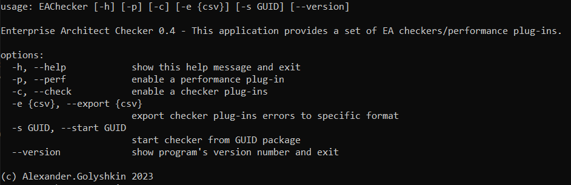

# EAChecker

EAChecker a Python 3.10x based application (Windows ONLY) for simple checking Sparx System Enterprise models for:

1. Package Structure
2. Correct Package Naming
3. Diagrams naming
4. Diagrams specific elements presence
5. etc..

EAChecker is a console application which implements a plug-ins approach and allows easy adding a new checkers to the system and use COM/File EA API for accessing to EA structure.

The following projects files are responsible for:

1. **plugins** - Plugins files
2. **common** - Common files
3. **utils** - Utility files
4. **interfaces** - SW Interface files
5. **exceptions** - Project used custom exceptions
6. **resources** - Application resources (e.g. configurations, etc.)

## Application configuration

1. **interfaces/EACheckerConfigBaseInterface.py** - code configuration file
2. **resources/configuration.xml** - user configuration file

An application help screenshot is below:


An application log snapshot is here: [ea-check.log](./ea-check.log) 

# Build instructions

Actually the project has the following external modules dependency

1. Clone project according to GitHub instructions
2. **$> pip install -r requirements.txt** - need to install required modules for project
3. Run the application using console command: **py Main.py** for getting HELP instruction

PS. For those people who don't want to install the Python 3.10x, there is compiled EXE for
WINDOWSx64 [EAChecker.exe](./deploy/EAChecker.exe) it also required to have [resources folder](./deploy/resources) on the same level for getting configuration (to allow to configure the EXE checker).

> [!NOTE]
Following **PyToExe** Cmd Line was used for generating an EXEx64 image:
```
pyinstaller --noconfirm --onefile --console --icon "Z:/Sprint 24/logo.ico" --name "EAChecker"  "Z:/Projects/EAChecker/main.py"
```
